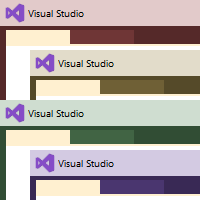

# VS2019-Themes
Visual Studio 2022 VSIX Theme extension project for the original Microsoft-provided themes available for VS2019.

# Color Themes from VS2019
Brings back to VS2022 the themes from the VS2019 Color Theme Editor.
If, like me, you're using VS2022 but you miss the color themes that Microsoft provided with the VS2019 Color Theme Editor, then this extension is for you. That package had 4 wonderful, simple color themes: Red, Tan, Green, and Purple . I also included the remaining 4 that were provided: Solarized Dark, Solarized Light, Dark with Light Editor, and Light with Dark Editor.

## Get the extension:
https://marketplace.visualstudio.com/items?itemName=JohnTasler.VS2019-ColorThemeEditor-Themes

